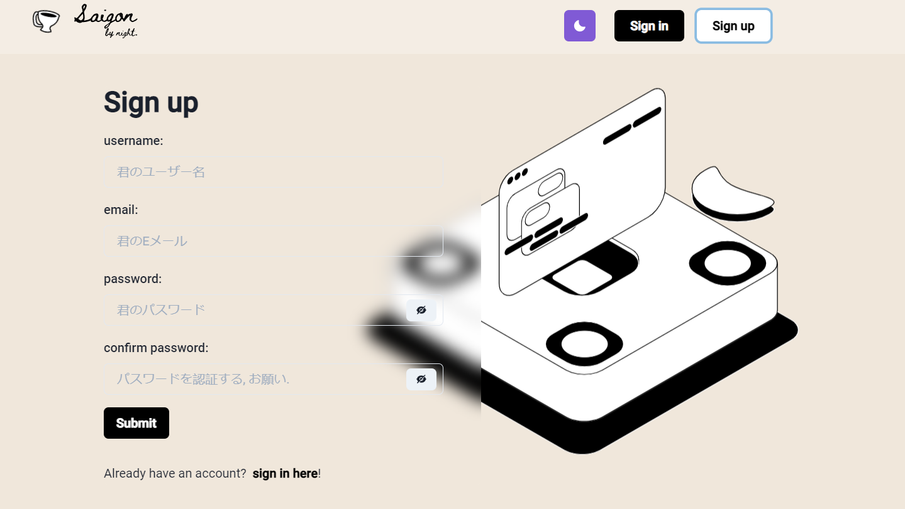

# saigonbynight


E-commerce marketing website model on Covid lockdown based on Facebook Group.
(This project has been stopped due to my lack of experience when merging 3 frameworks altogether make the website becoming more slowly).


## Frontend.

### [NextJS](https://nextjs.org/), [Chakra UI](https://chakra-ui.com/), [Firebase](https://firebase.google.com/) for authorization and authentication and [Husky](https://github.com/typicode/husky) for CI.

I deployed Client-side in [Vercel](https://vercel.com/).
If you curious about this project, you could visit this website [saigon-by-night.vercel.app](https://saigon-by-night.vercel.app)

To run the frontend, clone this entire repo.

```bash
$ cd SaigonByNight

$ touch .env.local
```

Inside `.env.local` file put all your `firebase-key.json` in and you good to go.

```bash
$ npm run dev
```

## Backend.

### [Django](https://www.djangoproject.com/) and [Firebase](https://firebase.google.com) for authorization and authentication.

I deployed Server-side in [Heroku](https://www.heroku.com/).

To run the backend, clone this entire repo.

```bash
$ cd SaigonByNight-Server

$ touch .env
```

If you using `Sendgrid`, put all the `API keys` in there or contact me to give you `.env` file.

```bash
$ python manage.py makemigrations

$ python manage.py migrate

$ python manage.py createsuperuser

$ python manage.py runserver
```

## Some images of this project.





## License

[MIT](LICENSE)
